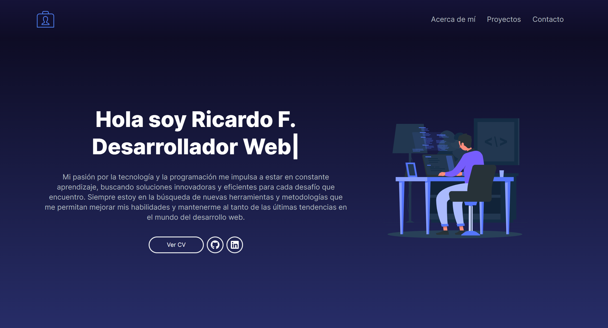

# Portafolio Personal con Next.js y Tailwind CSS

Bienvenido a mi portafolio personal, una creación elaborada con Next.js y estilizada con Tailwind CSS. Este proyecto refleja mi dedicación hacia un diseño minimalista y eficiente, destacando de manera clara y atractiva mis habilidades, proyectos y experiencia en el campo del desarrollo web.

## Tecnologías Utilizadas

- [Next.js](https://nextjs.org/)
- [Tailwind CSS](https://tailwindcss.com/) 
- [Framer Motion](https://www.framer.com/motion/) 
- [HTML](https://developer.mozilla.org/es/docs/Web/HTML) 
- [JavaScript](https://developer.mozilla.org/es/docs/Web/JavaScript) 

## Características Principales

- **Diseño Responsivo:** El portafolio está diseñado para ser totalmente receptivo y funcionar en una variedad de dispositivos y tamaños de pantalla.
- **Animaciones con Framer Motion:** Utiliza la biblioteca Framer Motion para agregar animaciones elegantes y atractivas a los elementos de la interfaz de usuario.
- **Muestra de Proyectos:** Se presentan proyectos realizados de manera clara y atractiva, con detalles como imágenes, descripciones y enlaces a repositorios y vistas previas.
- **Sección de Contacto:** Incluye una sección de contacto donde los visitantes pueden enviar mensajes directos desde el portafolio.

## Despliegue

Abre la pagina web: https://portafolio-ricardo-f-u.vercel.app/, para acceder al portafolio.

## Licencia

Este proyecto fue desarrollado por Ricardo Fuentes, Alias (RichiFu)

